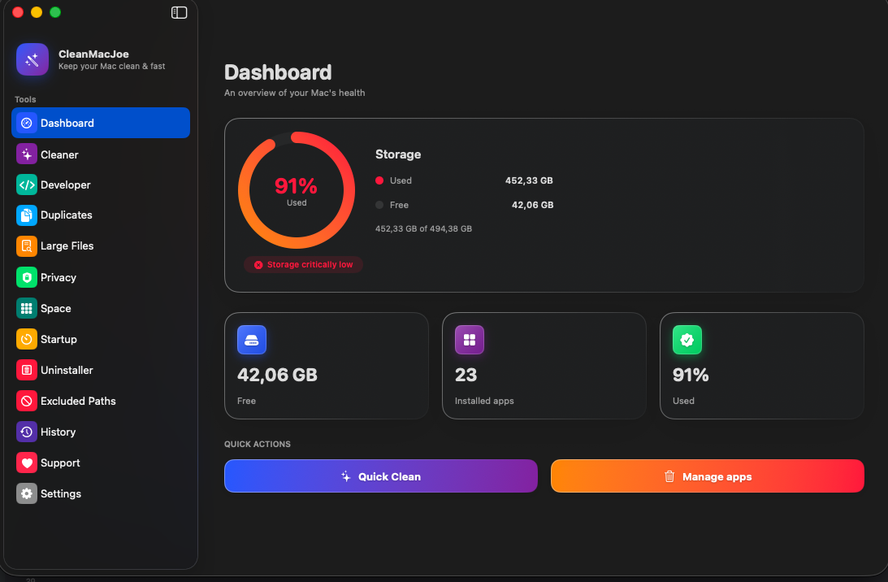

# CleanMacJoe

  

<h3 align="center">CleanMacJoe</h3>

  <b>Free macOS disk cleaner, duplicate finder, and app uninstaller — built natively in SwiftUI.</b>

  
  
  
  
  
  
  

  

---

CleanMacJoe helps you reclaim disk space and keep your Mac tidy. It scans for junk files, finds duplicates, locates large files, removes apps along with all their leftover data, and gives you a clear picture of your storage — all in a clean, native macOS interface.

> [!NOTE]
> **Safety First:** Everything CleanMacJoe removes goes to the macOS **Trash**, never permanently deleted. You can always restore files from there if you change your mind.

---

## 🔒 Trust & Security (Apple Notarized)

Because CleanMacJoe is a utility that performs system cleanups and requires **Full Disk Access**, security and transparency are our highest priorities:

* **Signed & Notarized**: Every release is signed with a valid Apple **Developer ID** and notarized by Apple's automated notary service. This ensures the app is recognized as safe and opens without security warnings on macOS.
* **100% Offline & Private**: CleanMacJoe runs entirely on your local machine. No file lists, user data, or personal details ever leave your Mac. Zero telemetry. Zero tracking. Zero ads. Ever.
* **VirusTotal Verified**: Every release DMG is submitted to [VirusTotal](https://www.virustotal.com) (scanned by 70+ antivirus engines) before publishing. The scan report link is included in each [release's notes](https://github.com/joemockdao/CleanMacJoe/releases).
* **Closed-Source Notice**: To prevent clone apps from charging users on the Mac App Store, the source code is private. However, we are fully committed to safety — you can monitor file operations in real time, and independent security audits are always welcome.

---

## ⚡ How CleanMacJoe Compares

| Feature | CleanMacJoe | Paid Commercial Cleaners | Legacy Utilities |
| :--- | :--- | :--- | :--- |
| **Cost** | 🟢 **100% Free** | 🔴 Expensive Subscriptions | 🟡 Free but complex / ad-supported |
| **Interface** | 🟢 SwiftUI Native & Modern | 🔴 Heavy, customized, non-standard UI | 🔴 Outdated, non-native layout |
| **Leftovers Finder** | 🟢 Automatic trash monitoring | 🟢 Yes | 🔴 Manual only |
| **RAM Reclaimer** | 🟢 Yes (with CPU monitor) | 🟢 Yes | 🔴 No |
| **Telemetry & Ads** | 🟢 Zero trackers / Ads | 🔴 Heavy tracking and upsell ads | 🟢 None |

---

## 🚀 Key Features

### 💻 Dashboard
A live overview of your disk: total space, used space, and a storage ring that shows at a glance how full your drive is. Quick Actions let you start a clean or manage apps in one tap.

### 🧹 Disk Cleaner
Scans for reclaimable junk across several categories:

| Category | What it finds |
| :--- | :--- |
| **User Cache** | App caches stored in `~/Library/Caches` |
| **Logs** | Log files from `~/Library/Logs` |
| **Trash** | Files waiting in your Trash |
| **Derived Data** | Xcode build artifacts in `~/Library/Developer/Xcode/DerivedData` |
| **Browser Cache** | Cached data from Safari, Chrome, Firefox, and other browsers |
| **App Leftovers** | Orphaned support files left behind by uninstalled apps |

Select what to remove, review the list, and clean with one click.

### 📦 App Uninstaller & Trash Monitor
* **Uninstaller**: Browse all installed apps and uninstall them completely. CleanMacJoe finds and removes associated support files, preferences, and caches that a simple drag-to-Trash misses.
* **Real-Time Trash Monitor**: Watches the Trash in the background. Dragging an app to the Trash prompts an automatic search for associated leftover folders, allowing you to clean them with one tap.

### 🔋 Mac Health & Battery Diagnostics
Monitor your MacBook's real-time battery status, health, and system hardware:
* **Battery Health & Cycles**: View actual maximum capacity in mAh vs original factory design, precise cycle count tracking, cell temperature in °C, and charger wattage.
* **Storage & SSD S.M.A.R.T. Health**: Internal drive model verification, S.M.A.R.T. health status, and APFS partition visual breakdown (Used, Purgeable, and Free space).
* **System Specs & Thermal**: Processor architecture details (Apple Silicon / Intel performance & efficiency cores), unified memory, system uptime, and thermal pressure state.
* **Battery Longevity Best Practices**: Built-in guide with practical tips (20-80% charge rule, thermal care, optimized charging).

### 🐏 RAM Reclaimer & System Monitor
Monitor your Mac's memory and CPU in real time. See active, inactive, wired, and compressed RAM. View the top resource hogs and terminate them directly, or reclaim inactive memory with a single click.

### 📂 Space Analyzer
Visual breakdown of disk usage across your home folder. See at a glance which folders and subfolders are consuming the most space.

### 👥 Duplicate & Large Files Finder
* **Duplicates**: Finds duplicate files on your Mac and lets you review and remove copies, keeping the originals safe.
* **Large Files**: Scans your home folder for the biggest files so you can quickly decide what's worth keeping.

### ⚙️ Startup Items Manager
View and remove login items and launch agents that start automatically and slow down your Mac's boot time.

---

## 🛠️ Requirements & Installation

### Requirements
* **macOS 15.0** or later (macOS Sequoia and newer)
* **Full Disk Access**: Required so the app can scan caches and app leftovers. macOS will prompt you to grant this on first launch (*System Settings → Privacy & Security → Full Disk Access*).

### Installation
1. Download `CleanMacJoe_2.3.1.dmg` from the [Latest Releases](https://github.com/joemockdao/CleanMacJoe/releases/latest).
2. Open the DMG file and drag **CleanMacJoe** into your **Applications** folder.
3. Launch the app and grant Full Disk Access when prompted.

---

## 🔄 Version History

### 2.3.1
* **Support Screen Update** — Added a link to Klipzen, a new macOS video editing app, in the "Other Apps by the Developer" section.

### 2.3
* **Mac Health & Battery Diagnostics** — Real-time battery diagnostics with circular progress gauge, actual maximum battery capacity vs original factory design in mAh, accurate cycle count tracking, cell temperature in °C, live charger wattage & adapter info, and smart battery care tips.
* **Storage & SSD S.M.A.R.T. Health** — Internal drive inspection (Apple SSD model and media type), S.M.A.R.T. status verification, and APFS partition visual breakdown (Used, Purgeable, and Free space).
* **Hardware & Thermal Pressure Monitoring** — Live Mac specs inspection with Apple Silicon / Intel architecture details, core breakdown (Performance vs Efficiency cores), unified memory, system uptime, and thermal pressure diagnostics.
* **Desktop Mac Power Fallback** — Automatic recognition and clean display for desktop Macs (Mac mini, Mac Studio, iMac, Mac Pro) with continuous AC power.

### 2.2
* **More Reliable Duplicate Finder** — Fixed an issue where scanning large Photos/Movies/Music libraries for duplicates could make the app unresponsive. Cancel and navigation now stay responsive throughout the whole scan, even on very large libraries.
* **More Reliable Cancel on Every Scan** — Cancel now works reliably on every scan screen (Cleaner, Duplicates, Developer Tools, Snapshots, iOS Backups, Space Analyzer, Startup Items), even if you switch to another screen mid-scan and come back later.
* **Time Machine Snapshot Deletion Feedback** — The app now correctly reports when a local snapshot fails to delete instead of silently showing success.
* **RAM Reclaimer Feedback** — Clearer feedback when there's no memory left to reclaim, when reclaiming fails, or when an app can't be quit.
* **General reliability improvements** — A number of smaller edge-case fixes across the app.

### 2.1
* **Persistent Navigation State** — Switching between sections (Cleaner, Uninstaller, Dashboard, etc.) no longer resets your view. Scan results and scroll position are preserved as you navigate the sidebar.
* **Cancel Scan** — Every scan screen now has a Cancel button. Stop a running scan at any point without waiting for it to finish; the app remains fully responsive.
* **Dashboard Auto-Refresh** — Storage stats update automatically each time you return to the Dashboard, so the numbers always reflect the latest cleanup you just ran.
* **Unified Design System** — Layout dimensions are now driven by named constants (`summaryBarButton`, `menuBarPanel`, `popover`) and shared across all views, eliminating visual inconsistencies. Shared components like `ItemInfoPopover` replace duplicated code.
* **Linktree in Support** — The Support screen now includes a link to the developer's Linktree page to discover other projects.

### 2.0
* **RAM Reclaimer & System Monitor** — Real-time memory and CPU monitoring with a process list to terminate resource-hungry processes.
* **Menu Bar Widget** — A persistent icon for instant access to disk usage statistics and junk alerts.
* **Settings Screen** — Dedicated settings panel with language picker and Smart Notification thresholds.
* **CPU Monitor** — Track high CPU usage apps alongside memory consumption in a tabbed view.

### 1.9
* **Real-Time Trash Monitor** — Automatically detects dragged apps in Trash, scans for associated leftovers (caches, support files), and alerts you.
* **New Display Languages** — Full localization support for Czech (Čeština) and Hungarian (Magyar).

### 1.8
* **Startup Items Manager** — Remove launch items to speed up Mac startup times.
* **Cleanup History** — Detailed log of every cleaning session with bytes reclaimed.
* **Excluded Paths** — Add directories to skip during scanning.
* **Space Analyzer** — Detailed visual folder explorer.

---

## 🌍 Languages

Fully supports automatic interface translation based on your macOS system language:
* 🇺🇸 English
* 🇮🇹 Italian
* 🇩🇪 German
* 🇪🇸 Spanish
* 🇫🇷 French
* 🇰🇷 Korean
* 🇳🇱 Dutch
* 🇷🇺 Russian
* 🇨🇳 Chinese (Simplified)
* 🇨🇿 Czech
* 🇭🇺 Hungarian

---

## 📬 Feedback & Support

Your feedback directly shapes CleanMacJoe. If you find a bug, have a feature idea, or want to contribute:
* **Open an issue**: [github.com/joemockdao/CleanMacJoe/issues](https://github.com/joemockdao/CleanMacJoe/issues)
* **Start a discussion**: [github.com/joemockdao/CleanMacJoe/discussions](https://github.com/joemockdao/CleanMacJoe/discussions)

### Other Apps by the Developer
Check out my other projects on the App Store and beyond:
* 🛌 [SleepRec](https://apps.apple.com/it/app/sleeprec/id1528754113) — Advanced sleep analysis and rest tracker.
* 📝 [JoeNote](https://apps.apple.com/it/app/joenote/id6738133424) — Sleek notes and reminders organizer.
* 🎬 [Klipzen](https://github.com/joemockdao/Klipzen) — macOS video editing app.
* 🔗 [Linktree](https://linktr.ee/joemockdevmobile) — All my projects in one place.

---

## 📄 License

Free to use. This repository hosts precompiled releases only. Source code is not public.
